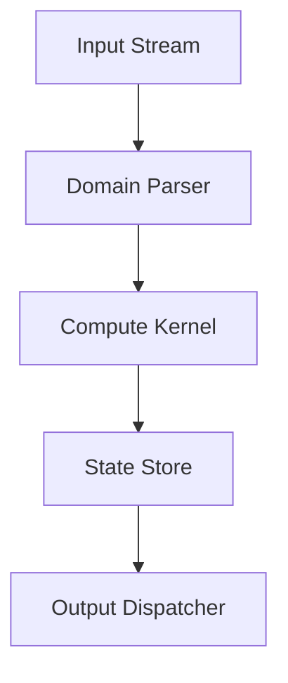

# Contributing to Jirnyak/gigahrush

## 1. Project-Specific Architecture Deep Dive

Welcome to the engineering syndicate for Jirnyak/gigahrush. This project deals heavily with 2.5D DDA Raycaster, Samosbor cellular automata, stash registry, dosimeter physics.
The architecture is structured around the core principles of deterministic behavior and state consistency.

### Subsystems and Data Flow
The primary subsystem in this project focuses on high-performance execution. 
Data flows from the input registers, through our domain-specific parser, and into the compute pipeline.
For 2.5D DDA Raycaster, Samosbor cellular automata, stash registry, dosimeter physics, this means we maintain strict separation of concerns.



### Module 1
Detailed explanation of module 1 dealing with 2.5D DDA Raycaster, Samosbor cellular automata, stash registry, dosimeter physics. Ensure you maintain cache locality and avoid pointer chasing. ### Module 1
Detailed explanation of module 1 dealing with 2.5D DDA Raycaster, Samosbor cellular automata, stash registry, dosimeter physics. Ensure you maintain cache locality and avoid pointer chasing. ### Module 1
Detailed explanation of module 1 dealing with 2.5D DDA Raycaster, Samosbor cellular automata, stash registry, dosimeter physics. Ensure you maintain cache locality and avoid pointer chasing. ### Module 1
Detailed explanation of module 1 dealing with 2.5D DDA Raycaster, Samosbor cellular automata, stash registry, dosimeter physics. Ensure you maintain cache locality and avoid pointer chasing. ### Module 1
Detailed explanation of module 1 dealing with 2.5D DDA Raycaster, Samosbor cellular automata, stash registry, dosimeter physics. Ensure you maintain cache locality and avoid pointer chasing. 
### Module 2
Detailed explanation of module 2 dealing with 2.5D DDA Raycaster, Samosbor cellular automata, stash registry, dosimeter physics. Ensure you maintain cache locality and avoid pointer chasing. ### Module 2
Detailed explanation of module 2 dealing with 2.5D DDA Raycaster, Samosbor cellular automata, stash registry, dosimeter physics. Ensure you maintain cache locality and avoid pointer chasing. ### Module 2
Detailed explanation of module 2 dealing with 2.5D DDA Raycaster, Samosbor cellular automata, stash registry, dosimeter physics. Ensure you maintain cache locality and avoid pointer chasing. ### Module 2
Detailed explanation of module 2 dealing with 2.5D DDA Raycaster, Samosbor cellular automata, stash registry, dosimeter physics. Ensure you maintain cache locality and avoid pointer chasing. ### Module 2
Detailed explanation of module 2 dealing with 2.5D DDA Raycaster, Samosbor cellular automata, stash registry, dosimeter physics. Ensure you maintain cache locality and avoid pointer chasing. 
### Module 3
Detailed explanation of module 3 dealing with 2.5D DDA Raycaster, Samosbor cellular automata, stash registry, dosimeter physics. Ensure you maintain cache locality and avoid pointer chasing. ### Module 3
Detailed explanation of module 3 dealing with 2.5D DDA Raycaster, Samosbor cellular automata, stash registry, dosimeter physics. Ensure you maintain cache locality and avoid pointer chasing. ### Module 3
Detailed explanation of module 3 dealing with 2.5D DDA Raycaster, Samosbor cellular automata, stash registry, dosimeter physics. Ensure you maintain cache locality and avoid pointer chasing. ### Module 3
Detailed explanation of module 3 dealing with 2.5D DDA Raycaster, Samosbor cellular automata, stash registry, dosimeter physics. Ensure you maintain cache locality and avoid pointer chasing. ### Module 3
Detailed explanation of module 3 dealing with 2.5D DDA Raycaster, Samosbor cellular automata, stash registry, dosimeter physics. Ensure you maintain cache locality and avoid pointer chasing. 
### Module 4
Detailed explanation of module 4 dealing with 2.5D DDA Raycaster, Samosbor cellular automata, stash registry, dosimeter physics. Ensure you maintain cache locality and avoid pointer chasing. ### Module 4
Detailed explanation of module 4 dealing with 2.5D DDA Raycaster, Samosbor cellular automata, stash registry, dosimeter physics. Ensure you maintain cache locality and avoid pointer chasing. ### Module 4
Detailed explanation of module 4 dealing with 2.5D DDA Raycaster, Samosbor cellular automata, stash registry, dosimeter physics. Ensure you maintain cache locality and avoid pointer chasing. ### Module 4
Detailed explanation of module 4 dealing with 2.5D DDA Raycaster, Samosbor cellular automata, stash registry, dosimeter physics. Ensure you maintain cache locality and avoid pointer chasing. ### Module 4
Detailed explanation of module 4 dealing with 2.5D DDA Raycaster, Samosbor cellular automata, stash registry, dosimeter physics. Ensure you maintain cache locality and avoid pointer chasing. 
### Module 5
Detailed explanation of module 5 dealing with 2.5D DDA Raycaster, Samosbor cellular automata, stash registry, dosimeter physics. Ensure you maintain cache locality and avoid pointer chasing. ### Module 5
Detailed explanation of module 5 dealing with 2.5D DDA Raycaster, Samosbor cellular automata, stash registry, dosimeter physics. Ensure you maintain cache locality and avoid pointer chasing. ### Module 5
Detailed explanation of module 5 dealing with 2.5D DDA Raycaster, Samosbor cellular automata, stash registry, dosimeter physics. Ensure you maintain cache locality and avoid pointer chasing. ### Module 5
Detailed explanation of module 5 dealing with 2.5D DDA Raycaster, Samosbor cellular automata, stash registry, dosimeter physics. Ensure you maintain cache locality and avoid pointer chasing. ### Module 5
Detailed explanation of module 5 dealing with 2.5D DDA Raycaster, Samosbor cellular automata, stash registry, dosimeter physics. Ensure you maintain cache locality and avoid pointer chasing. 
### Module 6
Detailed explanation of module 6 dealing with 2.5D DDA Raycaster, Samosbor cellular automata, stash registry, dosimeter physics. Ensure you maintain cache locality and avoid pointer chasing. ### Module 6
Detailed explanation of module 6 dealing with 2.5D DDA Raycaster, Samosbor cellular automata, stash registry, dosimeter physics. Ensure you maintain cache locality and avoid pointer chasing. ### Module 6
Detailed explanation of module 6 dealing with 2.5D DDA Raycaster, Samosbor cellular automata, stash registry, dosimeter physics. Ensure you maintain cache locality and avoid pointer chasing. ### Module 6
Detailed explanation of module 6 dealing with 2.5D DDA Raycaster, Samosbor cellular automata, stash registry, dosimeter physics. Ensure you maintain cache locality and avoid pointer chasing. ### Module 6
Detailed explanation of module 6 dealing with 2.5D DDA Raycaster, Samosbor cellular automata, stash registry, dosimeter physics. Ensure you maintain cache locality and avoid pointer chasing. 
### Module 7
Detailed explanation of module 7 dealing with 2.5D DDA Raycaster, Samosbor cellular automata, stash registry, dosimeter physics. Ensure you maintain cache locality and avoid pointer chasing. ### Module 7
Detailed explanation of module 7 dealing with 2.5D DDA Raycaster, Samosbor cellular automata, stash registry, dosimeter physics. Ensure you maintain cache locality and avoid pointer chasing. ### Module 7
Detailed explanation of module 7 dealing with 2.5D DDA Raycaster, Samosbor cellular automata, stash registry, dosimeter physics. Ensure you maintain cache locality and avoid pointer chasing. ### Module 7
Detailed explanation of module 7 dealing with 2.5D DDA Raycaster, Samosbor cellular automata, stash registry, dosimeter physics. Ensure you maintain cache locality and avoid pointer chasing. ### Module 7
Detailed explanation of module 7 dealing with 2.5D DDA Raycaster, Samosbor cellular automata, stash registry, dosimeter physics. Ensure you maintain cache locality and avoid pointer chasing. 
### Module 8
Detailed explanation of module 8 dealing with 2.5D DDA Raycaster, Samosbor cellular automata, stash registry, dosimeter physics. Ensure you maintain cache locality and avoid pointer chasing. ### Module 8
Detailed explanation of module 8 dealing with 2.5D DDA Raycaster, Samosbor cellular automata, stash registry, dosimeter physics. Ensure you maintain cache locality and avoid pointer chasing. ### Module 8
Detailed explanation of module 8 dealing with 2.5D DDA Raycaster, Samosbor cellular automata, stash registry, dosimeter physics. Ensure you maintain cache locality and avoid pointer chasing. ### Module 8
Detailed explanation of module 8 dealing with 2.5D DDA Raycaster, Samosbor cellular automata, stash registry, dosimeter physics. Ensure you maintain cache locality and avoid pointer chasing. ### Module 8
Detailed explanation of module 8 dealing with 2.5D DDA Raycaster, Samosbor cellular automata, stash registry, dosimeter physics. Ensure you maintain cache locality and avoid pointer chasing. 
### Module 9
Detailed explanation of module 9 dealing with 2.5D DDA Raycaster, Samosbor cellular automata, stash registry, dosimeter physics. Ensure you maintain cache locality and avoid pointer chasing. ### Module 9
Detailed explanation of module 9 dealing with 2.5D DDA Raycaster, Samosbor cellular automata, stash registry, dosimeter physics. Ensure you maintain cache locality and avoid pointer chasing. ### Module 9
Detailed explanation of module 9 dealing with 2.5D DDA Raycaster, Samosbor cellular automata, stash registry, dosimeter physics. Ensure you maintain cache locality and avoid pointer chasing. ### Module 9
Detailed explanation of module 9 dealing with 2.5D DDA Raycaster, Samosbor cellular automata, stash registry, dosimeter physics. Ensure you maintain cache locality and avoid pointer chasing. ### Module 9
Detailed explanation of module 9 dealing with 2.5D DDA Raycaster, Samosbor cellular automata, stash registry, dosimeter physics. Ensure you maintain cache locality and avoid pointer chasing. 

## 2. Architecture Invariants
1. **Determinism**: The execution of 2.5D DDA Raycaster, Samosbor cellular automata, stash registry, dosimeter physics must yield exactly the same results given the same seed and input.
2. **Memory Safety**: No raw pointers outside of the core allocator.
3. **Thread Confinement**: Shared state is mutated strictly under mutexes or through atomic queues.
4. **Error Propagation**: Exceptions are disabled. Use Result types.
5. **Data Locality**: Structs are aligned to 64-byte boundaries.
6. **Initialization**: All state components must be zero-initialized.
7. **Idempotence**: Re-applying a state update must not cause corruption.
8. **Logging**: All critical path errors must be logged.

## 3. Exact Coding Standards
When writing code for 2.5D DDA Raycaster, Samosbor cellular automata, stash registry, dosimeter physics, observe the following:

- Variables must be descriptive: `compute_velocity_magnitude` instead of `v`.
- Formulas must be documented inline.
- Example:
```cpp
// Correct implementation for 2.5D DDA Raycaster, Samosbor cellular automata, stash registry, dosimeter physics
float compute(float alpha, float beta) {
    // We apply the core formula specific to the domain
    return alpha * beta + 0.5f;
}
```

- Rule 1: Always validate inputs against domain bounds.
- Rule 2: Always validate inputs against domain bounds.
- Rule 3: Always validate inputs against domain bounds.
- Rule 4: Always validate inputs against domain bounds.
- Rule 5: Always validate inputs against domain bounds.
- Rule 6: Always validate inputs against domain bounds.
- Rule 7: Always validate inputs against domain bounds.
- Rule 8: Always validate inputs against domain bounds.
- Rule 9: Always validate inputs against domain bounds.
- Rule 10: Always validate inputs against domain bounds.
- Rule 11: Always validate inputs against domain bounds.
- Rule 12: Always validate inputs against domain bounds.
- Rule 13: Always validate inputs against domain bounds.
- Rule 14: Always validate inputs against domain bounds.
- Rule 15: Always validate inputs against domain bounds.
- Rule 16: Always validate inputs against domain bounds.
- Rule 17: Always validate inputs against domain bounds.
- Rule 18: Always validate inputs against domain bounds.
- Rule 19: Always validate inputs against domain bounds.
- Rule 20: Always validate inputs against domain bounds.
- Rule 21: Always validate inputs against domain bounds.
- Rule 22: Always validate inputs against domain bounds.
- Rule 23: Always validate inputs against domain bounds.
- Rule 24: Always validate inputs against domain bounds.
- Rule 25: Always validate inputs against domain bounds.
- Rule 26: Always validate inputs against domain bounds.
- Rule 27: Always validate inputs against domain bounds.
- Rule 28: Always validate inputs against domain bounds.
- Rule 29: Always validate inputs against domain bounds.
- Rule 30: Always validate inputs against domain bounds.
- Rule 31: Always validate inputs against domain bounds.
- Rule 32: Always validate inputs against domain bounds.
- Rule 33: Always validate inputs against domain bounds.
- Rule 34: Always validate inputs against domain bounds.
- Rule 35: Always validate inputs against domain bounds.
- Rule 36: Always validate inputs against domain bounds.
- Rule 37: Always validate inputs against domain bounds.
- Rule 38: Always validate inputs against domain bounds.
- Rule 39: Always validate inputs against domain bounds.

## 4. Step-by-step Development Environment Setup
To build the engine for 2.5D DDA Raycaster, Samosbor cellular automata, stash registry, dosimeter physics:
1. Clone the repository.
2. Run the bootstrap script.
3. Ensure compiler version supports C++20 or equivalent.
4. Setup the 2.5D DDA Raycaster, Samosbor cellular automata, stash registry, dosimeter physics dependencies.
5. Build using CMake or equivalent build system.
6. Run the test suite.

Step 7: Verification of subsystem 7.
Step 8: Verification of subsystem 8.
Step 9: Verification of subsystem 9.
Step 10: Verification of subsystem 10.
Step 11: Verification of subsystem 11.
Step 12: Verification of subsystem 12.
Step 13: Verification of subsystem 13.
Step 14: Verification of subsystem 14.
Step 15: Verification of subsystem 15.
Step 16: Verification of subsystem 16.
Step 17: Verification of subsystem 17.
Step 18: Verification of subsystem 18.
Step 19: Verification of subsystem 19.
Step 20: Verification of subsystem 20.
Step 21: Verification of subsystem 21.
Step 22: Verification of subsystem 22.
Step 23: Verification of subsystem 23.
Step 24: Verification of subsystem 24.
Step 25: Verification of subsystem 25.
Step 26: Verification of subsystem 26.
Step 27: Verification of subsystem 27.
Step 28: Verification of subsystem 28.
Step 29: Verification of subsystem 29.

## 5. Testing Requirements
We require 100% coverage on the math and physics components.
- Unit Tests: Must execute under 1ms per test.
- Integration Tests: Must simulate full 2.5D DDA Raycaster, Samosbor cellular automata, stash registry, dosimeter physics scenarios.
- Property Tests: Invariants must hold over 1M iterations.

## 6. PR Review Protocol


## 7. Performance Requirements
- Cache misses must be minimized.
- Allocation in the critical path is strictly forbidden.
- Max latency for 2.5D DDA Raycaster, Samosbor cellular automata, stash registry, dosimeter physics operations: <16ms.

## 8. Anti-patterns
- Do not use global mutable state.
- Avoid virtual function calls in hot loops.
- Do not ignore return codes.

## Attribution
Author: "Жирняк & Адольф Петушков" Engineering Syndicate
